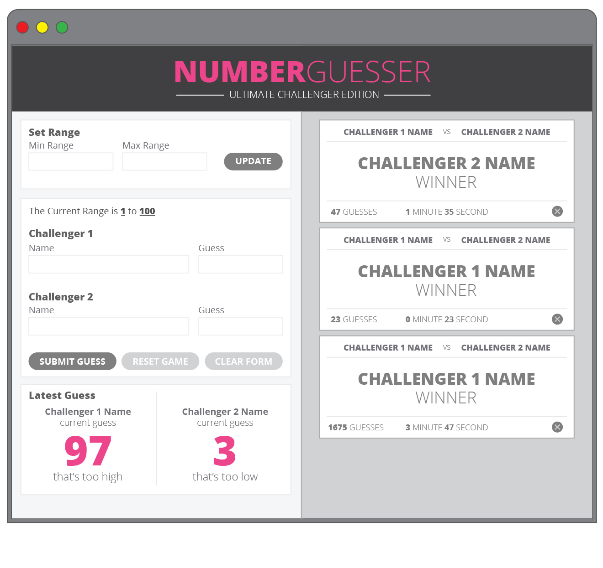
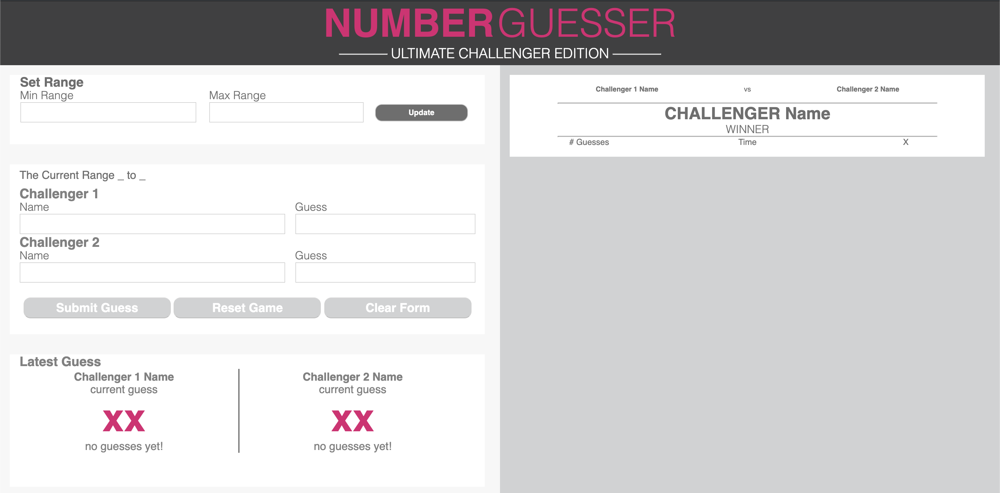

# Number Guesser
Number Guesser is a number guessing game which allows 2 players to guess a generated number and play until there is a winner.

## Contributing
This project was created by Justin Corbin and Kimala Cochran.

### Comp Recreation

These were the provided comps:

Number Guesser zero state

Number Guesser with winner cards

And this was our result:

